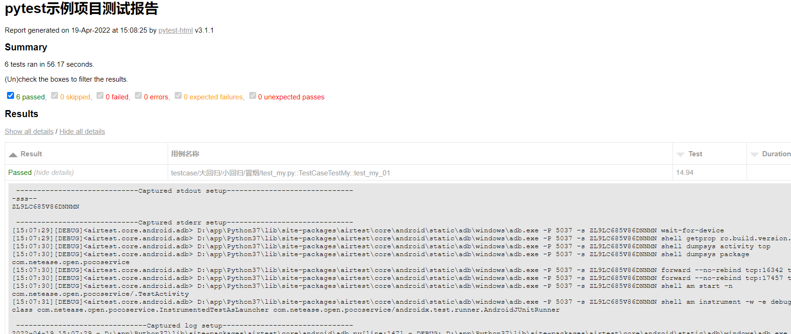

## 执行

- 直接输入命令 
```buildoutcfg
pytest -s testcase/大回归/小回归/冒烟 --html=report.html --self-contained-html --capture=sys
```

- 运行runner.py中代码
```buildoutcfg
from multiprocessing import Process

import pytest


def main(path, report, dev):
    # pytest.main(['%s' %path,'-m finished1', '--html=%s' % report,'--self-contained-html', '--capture=sys'])
    pytest.main(['%s' %path,'--dev=%s'% dev, '--html=%s' % report,'--self-contained-html', '--capture=sys'])


if __name__ == '__main__':
    test_case = Process(target=main, args=("d:\\project\\pytest-airtest\\testcase\\大回归\\小回归\\冒烟","report1.html",'ZL9LC685V86DNNMN'))
    test_case.start()


    test_case1 = Process(target=main, args=("d:\\project\\pytest-airtest\\testcase\\大回归\\小回归\\","report2.html",'emulator-5554'))
    test_case1.start()

    test_case.join()
    test_case1.join()
```


